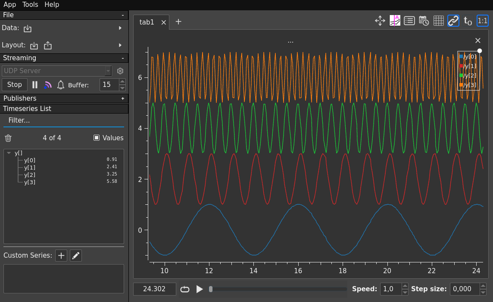

# Realtime plotting of Serial data with [Plotjuggler](https://plotjuggler.io/)

This minimal example shows how I use a serial interface to plot realtime data
from for example an Arduino in Plotjuggler. This example was done on Ubuntu 20.04.


### Device

An Arduino Uno R3 is used for this example, see the sketch `serial-json-data`
in this repo, but in short it'll generate some data and send a string with JSON
over serial.


### Plotjuggler

Under "Streaming", start a UDP server, I'll use port 9871 for this example and
set JSON as the message protocol.


## Usage

Compile, upload and send to plotjuggler with

```
make upload && make realtime-plotjuggler
```

And the result in Plotjuggler:




### Receiving Serial and sending to Plotjuggler

Make target `realtime-plotjuggler` does the following: reads from the
serial device `/dev/ttyACM0` and pipes it to netcat which sends it to
plotjuggler

```
cat /dev/ttyACM0 | nc -u localhost 9871
```


## TODO

- [ ] Plotjuggler supports [Protocol
  buffers](https://github.com/protocolbuffers/protobuf) and some other
  protocols, play around a bit with that to see if it can be used in a similar
  way.
